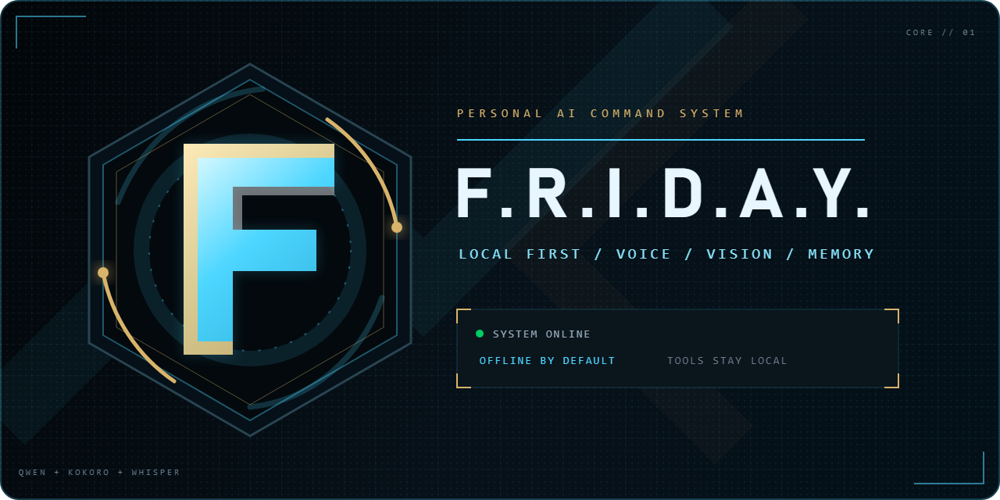
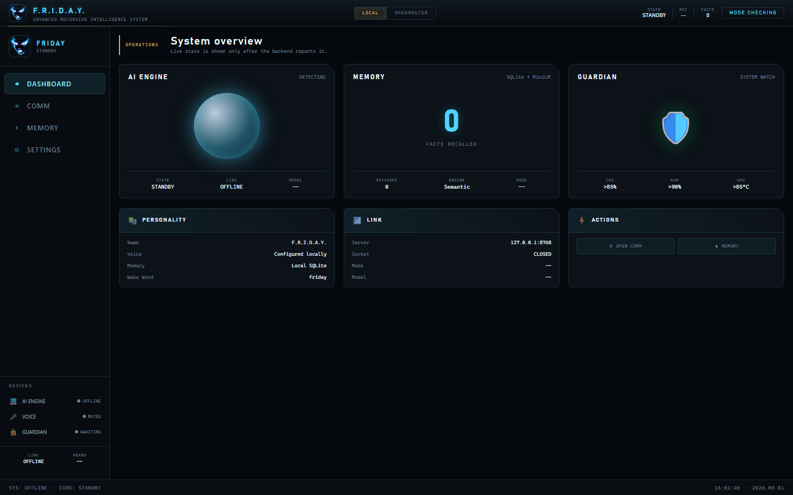
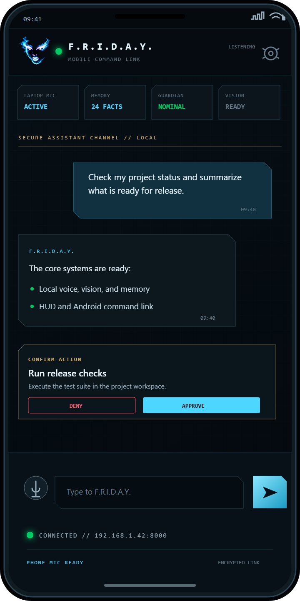
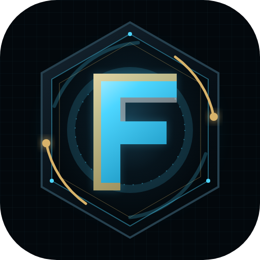

<p align="center">
  
</p>

# F.R.I.D.A.Y.

F.R.I.D.A.Y. is a Windows-first personal AI assistant that combines a local
Qwen vision-language model with voice control, semantic memory, a browser HUD,
local tools, procedural skills, and an optional Android companion. It runs
offline by default and can optionally use OpenRouter with Hermes Portal
failover for cloud reasoning.

## Interface Showcase

### Web HUD

<p align="center">
  
</p>

### Android Command Link

<p align="center">
  
</p>

### Official Logo

<p align="center">
  
</p>

## Highlights

- Local text and image reasoning through Qwen2.5-VL GGUF and `llama.cpp`
- Offline speech recognition with Faster Whisper
- Offline Kokoro neural speech using the `bf_isabella` voice
- Wake-word operation, interruption, mute, and manual stop controls
- Persistent semantic memory, session recall, and response-style learning
- Local task tools for files, applications, websites, reminders, shell tasks,
  Git operations, screenshots, weather, and web search
- Multi-step tool loops, bounded parallel calls, procedural skills, and
  depth-limited subagents
- FastAPI/WebSocket backend with a browser HUD and Electron launcher
- Android command link for devices on the same trusted network
- Optional OpenRouter reasoning with automatic Hermes Portal failover

## Repository Scope

This GitHub repository contains the source code, tests, scripts, HUD, Electron
launcher source, installer definition, and Android source. It intentionally
does **not** contain the large or machine-specific parts of the complete
offline kit:

- `models/`
- `wheels/`
- `py312/`
- `.venv/`
- `dist-launcher/`
- databases, settings, logs, captures, uploads, and built APK files

Therefore, a plain Git clone is not a complete offline installation. Use a
complete model/runtime bundle or supply the dependencies and models listed
below. `README.txt` contains the detailed operator manual for the bundled kit.

## Architecture

| Path | Purpose |
| --- | --- |
| `core/brain/` | Local GGUF inference and optional cloud reasoning |
| `core/ear/` | Microphone capture, wake flow, VAD, and speech recognition |
| `core/voice/` | Kokoro local TTS and online voice fallback |
| `core/memory/` | Durable facts, semantic retrieval, and sessions |
| `core/learning/` | Local preferences and response feedback |
| `core/hands/` | Tool registry, permissions, reminders, Git, and subagents |
| `core/skills/` | Procedural skill discovery and loading |
| `core/hud/` | FastAPI and WebSocket application server |
| `hud/static/` | Browser HUD assets |
| `launcher/` | Electron HUD launcher source |
| `friday-android/` | Kotlin/Jetpack Compose Android companion source |
| `tests/` | Python unit and reliability tests |

## Requirements

### Supported bundled setup

- Windows 10 or 11
- NVIDIA GPU recommended; RTX 3050 4 GB is the tested baseline
- A current NVIDIA driver compatible with CUDA 12.8
- Microphone for voice operation
- Internal SSD with enough space for the runtime and model bundle

CPU fallback is available, but local responses will be significantly slower.

### Required local models

Place the model files at these paths:

```text
models/
|-- qwen2.5-vl-3b-instruct-gguf/
|   |-- Qwen2.5-VL-3B-Instruct-Q4_K_M.gguf
|   `-- mmproj-Qwen2.5-VL-3B-Instruct-Q8_0.gguf
|-- faster-whisper-base.en/
|-- all-MiniLM-L6-v2/
|-- kokoro/
|   |-- kokoro-v1.0.onnx
|   `-- voices-v1.0.bin
`-- silero_vad/
    `-- silero_vad.onnx
```

The Qwen model and projector must be a matched pair. Custom paths can be set
with `FRIDAY_MODEL_PATH` and `FRIDAY_MMPROJ_PATH`.

## Installation

### Complete offline kit

This is the supported end-user installation path.

1. Copy the complete `friday-kit` directory to an internal SSD.
2. Run `INSTALL-FRIDAY.bat`.
3. Allow microphone and private-network access if Windows prompts for them.
4. Wait for the local model to load and the HUD to open at
   `http://127.0.0.1:8000`.

The installer creates or repairs `.venv`, installs from `wheels/deps` without
internet access, verifies CUDA, microphone input, memory embeddings, Kokoro,
automation modules, and local Qwen text/vision inference.

For later launches, use one of:

```text
LAUNCH-FRIDAY.bat
LAUNCH-HUD.bat
dist-launcher\FRIDAY-HUD.exe
```

### Source development

For development from this repository, install Python 3.12 and a compatible
CUDA or CPU build of PyTorch, then create an environment and install the
dependencies:

```powershell
py -3.12 -m venv .venv
.venv\Scripts\python.exe -m pip install --upgrade pip
.venv\Scripts\python.exe -m pip install -r requirements.txt
```

`requirements.txt` pins the bundled CUDA build of PyTorch. If that wheel is
not available from your configured package source, install the appropriate
PyTorch build first, then install the remaining dependencies. Add the required
models before starting the backend:

```powershell
.venv\Scripts\python.exe -m core.main
```

## Using F.R.I.D.A.Y.

### Text and voice

- Enter text in the HUD and press Enter or select Send.
- Say `Friday` followed by a request, or say `Friday`, wait for activation,
  and speak within eight seconds.
- Use the Stop control or speak while F.R.I.D.A.Y. is responding to interrupt.
- Headphones are recommended so the microphone does not hear synthesized
  speech from the speakers.

Examples:

```text
Friday, open Visual Studio Code.
Friday, set a timer for 20 minutes.
Friday, remember that I prefer concise answers.
Friday, find my quarterly report.
Friday, what is the weather in Dublin?
```

### Memory

Durable facts are stored locally and retrieved semantically when relevant.
Use `Remember that ...` for explicit storage, the HUD memory drawer to inspect
or forget facts, `EXPORT-MEMORY.bat` to create a backup, and
`RESET-MEMORY.bat` to erase local memory after confirmation.

Passwords, API tokens, PINs, private keys, and payment details are rejected by
the memory layer. Runtime databases are excluded from this repository.

### Tool permissions

The HUD includes an **Auto-accept permissions** toggle. When disabled,
sensitive reads, writes, shell commands, screen/camera access, and other
protected actions require HUD approval. When enabled, eligible tools can run
automatically.

The destructive-command blocklist and protected-path restrictions remain
active regardless of that toggle. Folder deletion, permanent deletion, and
dangerous system commands are blocked by design.

## Optional Cloud Reasoning

Local reasoning is the default even when cloud credentials exist.

1. Run `CONFIGURE-OPENROUTER.bat` and enter an OpenRouter API key.
2. Select OpenRouter in the launcher or set
   `FRIDAY_REASONING_MODE=openrouter`.
3. Restart F.R.I.D.A.Y. and check `http://127.0.0.1:8000/health`.

The default cloud model is `z-ai/glm-5.3-flash`. Override it with
`FRIDAY_OPENROUTER_MODEL`. Run `DISABLE-CLOUD-REASONING.bat` or set
`FRIDAY_REASONING_MODE=local` to force offline reasoning.

For failover, run `CONFIGURE-HERMES.bat`. OpenRouter authentication, quota,
timeout, rate-limit, and server failures can retry through Hermes Portal when
`FRIDAY_CLOUD_FALLBACK` is enabled.

Cloud mode sends the current request, relevant conversation history, selected
memory context, and attached images to the configured provider. Tool execution
remains on the local computer.

Never commit API keys. The configuration scripts store them in Windows user
environment variables rather than project files.

## Android Companion

The Android app requires Android SDK 35, Java 17, and Android 8.0 (API 26) or
newer. Build it from `friday-android`:

```powershell
friday-android\gradlew.bat assembleDebug
```

To connect, keep the Windows computer and phone on the same trusted Wi-Fi,
start F.R.I.D.A.Y., and open `CONFIG -> NETWORK` in the Windows HUD. Scan the
displayed QR code with the phone camera and tap the F.R.I.D.A.Y. link; the app
saves the LAN address, port, and security token automatically. Manual entry is
available only as a fallback.

The Android app opens on a mobile HUD with live CPU, RAM, disk, GPU, model,
memory, microphone, and reasoning-mode status. It also provides explicit
laptop microphone mute/unmute, Local/OpenRouter selection, and safe runtime
controls for temperature, top-p, output tokens, and context turns.

## Building the Electron HUD

Install Node.js, then run:

```text
BUILD-HUD.bat
```

The script runs `npm ci` and Electron Builder. Its portable output is written
to `dist-launcher/FRIDAY-HUD.exe`, which is intentionally not tracked by Git.
Use `DEV-HUD.bat` to run the Electron launcher in development mode.

## Tests

Run the Python test suite from the repository root:

```powershell
.venv\Scripts\python.exe -m unittest discover -s tests -p "test_*.py"
```

The current suite covers agent reliability, tools, permissions, background
tasks, learning, mode switching, and procedural skills.

## Troubleshooting

- **CUDA is unavailable:** update the NVIDIA driver and rerun the installer;
  CPU fallback remains available.
- **The microphone is unavailable:** allow desktop microphone access in
  Windows and run `CHECK-AUDIO.bat` to list devices.
- **F.R.I.D.A.Y. hears itself:** use headphones or reduce speaker volume.
- **Kokoro does not load:** verify both files under `models/kokoro/` and rerun
  the installer checks.
- **The first response is slow:** the local model loads once per process and
  may take one or two minutes on first launch.
- **Port 8000 is busy:** set `FRIDAY_PORT` to another port before launch.
- **Web search or weather fails:** those tools require an internet connection.

## License

This project is licensed under the [GNU General Public License v3.0](LICENSE).
